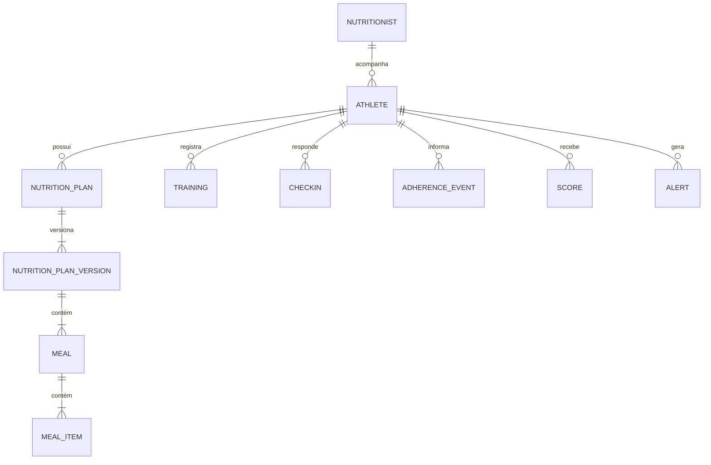

# Banco de dados

## Convenções

- PostgreSQL é o banco principal.
- Chaves primárias usam `BigAutoField` enquanto não houver decisão diferente registrada.
- Tabelas de domínio devem possuir `created_at` e `updated_at` quando o ciclo de vida for relevante.
- Foreign keys devem declarar comportamento de exclusão conscientemente e possuir nomes reversos claros.
- Regras que o banco puder garantir devem usar constraints e índices explícitos.
- Dados estruturados e conhecidos devem ser modelados relacionalmente, não escondidos em `JSONField`.
- Toda mudança de schema requer uma nova migration.

## Entidades existentes

Ainda não existem entidades de negócio. Apenas as tabelas internas do Django estão previstas na configuração inicial.

## Modelo conceitual inicial

Este diagrama é conceitual e não autoriza a criação antecipada de todas as tabelas.

## Histórico

- 2026-08-12: documento inicial; modelo de dados detalhado permanece pendente por feature.
