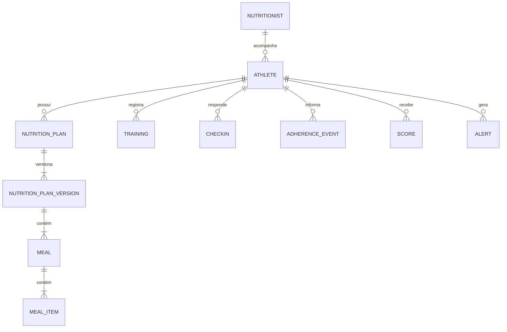

# Banco de dados

## Convenções

- PostgreSQL é o banco principal.
- Chaves primárias usam `BigAutoField` enquanto não houver decisão diferente registrada.
- Tabelas de domínio devem possuir `created_at` e `updated_at` quando o ciclo de vida for relevante.
- Foreign keys devem declarar comportamento de exclusão conscientemente e possuir nomes reversos claros.
- Regras que o banco puder garantir devem usar constraints e índices explícitos.
- Dados estruturados e conhecidos devem ser modelados relacionalmente, não escondidos em `JSONField`.
- Toda mudança de schema requer uma nova migration.

## Entidades existentes

### `accounts.User`

Identidade comum baseada em `AbstractUser`, persistida em `accounts_user`.

- PK: `BigAutoField`.
- Identificador de login: `email`, obrigatório e normalizado em minúsculas. A constraint funcional `accounts_user_email_ci_unique` garante unicidade case-insensitive no PostgreSQL.
- `username`: removido.
- `role`: obrigatório e limitado pela aplicação a `nutritionist` ou `athlete`.
- Credenciais: somente o campo de hash padrão do Django; nunca senha em texto.
- Estado e administração: `is_active`, `is_staff` e `is_superuser` do Django.
- Auditoria básica: `created_at` e `updated_at`.

Não existe `NutritionistProfile`: o usuário com papel `nutritionist` representa o responsável enquanto não houver dados próprios desse domínio.

### `athletes.Athlete`

Representa o acompanhamento de um usuário atleta por um nutricionista:

- `user`: relação one-to-one com `accounts.User`; o usuário deve possuir papel `athlete`.
- `nutritionist`: foreign key para `accounts.User`; o responsável deve possuir papel `nutritionist`.
- `is_active`: estado do acompanhamento na carteira, independente de `User.is_active`.
- `created_at` e `updated_at`: auditoria básica.
- `athlete_user_differs_from_nutritionist`: impede que usuário e responsável sejam a mesma identidade.

E-mail, nome e sobrenome permanecem em `accounts.User` e não são duplicados. A foreign key de `nutritionist` fornece o índice usado para filtrar a carteira. Atletas criados nesta etapa recebem senha inutilizável até o futuro fluxo seguro de convite.

### Blacklist JWT

As tabelas fornecidas por `rest_framework_simplejwt.token_blacklist` registram refresh tokens emitidos e revogados. Elas suportam rotação, bloqueio de reutilização e logout efetivo; não armazenam senhas.

### `athletes.AthleteInvitation`

Convite de primeiro acesso ligado a um `Athlete`:

- `token_hash`: SHA-256 único do token; o token bruto nunca é persistido.
- `created_at` e `expires_at`: emissão e expiração.
- `used_at`: preenchido após definição bem-sucedida da primeira senha.
- `revoked_at`: preenchido quando o convite é substituído ou revogado.

O estado é derivado desses timestamps: válido, expirado, utilizado ou revogado. Um novo convite revoga convites anteriores ainda abertos. O convite não substitui recuperação de senha.

## Modelo conceitual inicial

Este diagrama é conceitual e não autoriza a criação antecipada de todas as tabelas.

## Histórico

- 2026-08-12: documento inicial; modelo de dados detalhado permanece pendente por feature.
- 2026-08-12: criado o Custom User inicial com login por e-mail e papel.
- 2026-08-12: adicionadas as migrations oficiais da blacklist JWT.
- 2026-08-12: criado `athletes.Athlete` e o relacionamento explícito de carteira.
- 2026-08-12: criado `AthleteInvitation` para onboarding de uso único.
