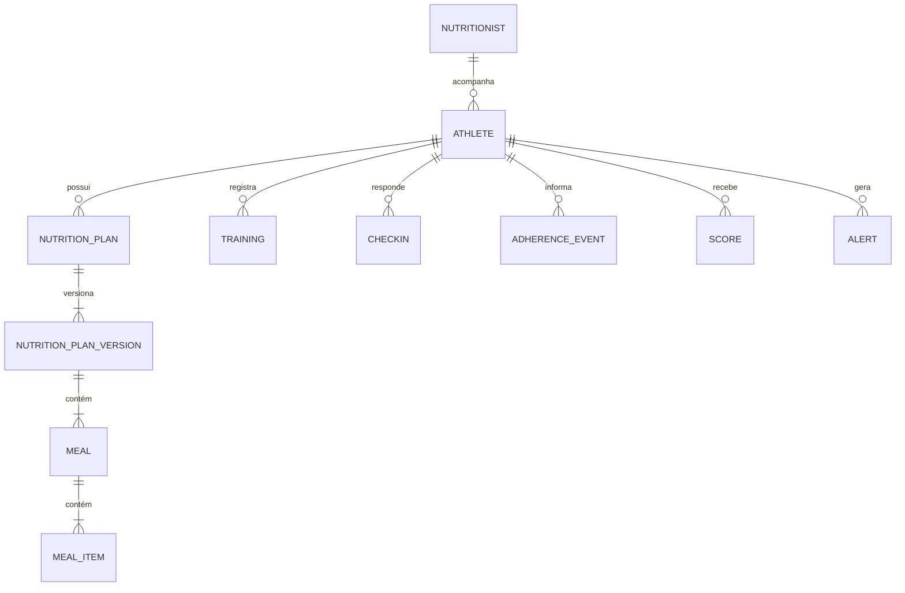

# Banco de dados

## Convenções

- PostgreSQL é o banco principal.
- Chaves primárias usam `BigAutoField` enquanto não houver decisão diferente registrada.
- Tabelas de domínio devem possuir `created_at` e `updated_at` quando o ciclo de vida for relevante.
- Foreign keys devem declarar comportamento de exclusão conscientemente e possuir nomes reversos claros.
- Regras que o banco puder garantir devem usar constraints e índices explícitos.
- Dados estruturados e conhecidos devem ser modelados relacionalmente, não escondidos em `JSONField`.
- Toda mudança de schema requer uma nova migration.

## Entidades existentes

### `accounts.User`

Identidade comum baseada em `AbstractUser`, persistida em `accounts_user`.

- PK: `BigAutoField`.
- Identificador de login: `email`, obrigatório e normalizado em minúsculas. A constraint funcional `accounts_user_email_ci_unique` garante unicidade case-insensitive no PostgreSQL.
- `username`: removido.
- `role`: obrigatório e limitado pela aplicação a `nutritionist` ou `athlete`.
- Credenciais: somente o campo de hash padrão do Django; nunca senha em texto.
- Estado e administração: `is_active`, `is_staff` e `is_superuser` do Django.
- Auditoria básica: `created_at` e `updated_at`.

Perfis `Nutritionist` e `Athlete` e o vínculo entre eles ainda não existem. Serão introduzidos somente quando possuírem dados e comportamento próprios.

### Blacklist JWT

As tabelas fornecidas por `rest_framework_simplejwt.token_blacklist` registram refresh tokens emitidos e revogados. Elas suportam rotação, bloqueio de reutilização e logout efetivo; não armazenam senhas.

## Modelo conceitual inicial

Este diagrama é conceitual e não autoriza a criação antecipada de todas as tabelas.

## Histórico

- 2026-08-12: documento inicial; modelo de dados detalhado permanece pendente por feature.
- 2026-08-12: criado o Custom User inicial com login por e-mail e papel.
- 2026-08-12: adicionadas as migrations oficiais da blacklist JWT.
